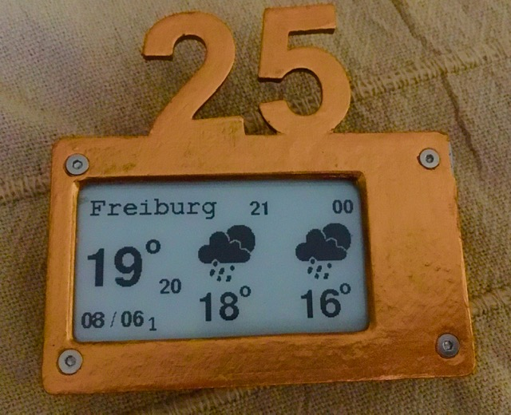
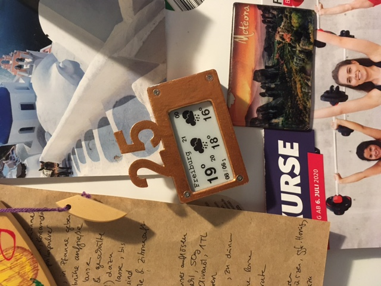
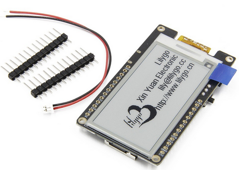

# E-Paper 

I made this E-Paper Weather forecast for my girlfriends 25th Birthday.

It will beforme the following task

1. Connect to Wifi
2. Get data from OpenWeather API 
3. Display data
4. Go to deep sleep (defined by user)

<p align="center"> 

</p>

You can pin it on a fridge like this:

<p align="center"> 

</p>

The device is made with a [Lilygo Epaper](http://www.lilygo.cn/prod_view.aspx?TypeId=50031&Id=1149&FId=t3:50031:3). For more details regarding the Pinouts please have a look at the website.

<p align="center"> 

</p>

# Code

The code uses the API from [OpenWeather](https://openweathermap.org/
). It is calling the API every houre (or depending on what you set in the code). You need the API key to retreive data (I you call the API seldomly a free account will be sufficient).

**main.cpp**

Set how long we set the E-Paper in deep sleep

```
const uint64_t TIME_TO_SLEEP  = 3600; // Time ESP32 will go to leep in seconds) every 1h
```

Set up the Wifi initails

```
WiFi.begin("<ssid>", "<psw>"); 
```

Set OpenWeather city and API key

```
  httpWeather.begin("http://api.openweathermap.org/data/2.5/forecast?q=<city>,de&cnt=3&units=metric&appid=<id>");
  httpWeatherNow.begin("http://api.openweathermap.org/data/2.5/weather?q=<city>,de&cnt=3&units=metric&appid=<id>");
```

# Additional

Next to the date is a small number which counts the wake ups from deep sleep. To remove thsi number just delete:

```
display.setFont(&FreeMonoBold9pt7b);
display.setCursor(55, 121);
display.print(bootCount);
```
